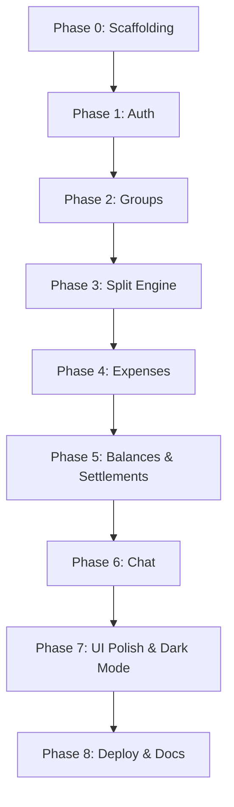

# BUILD_PLAN.md — FairShare MVP

> **Status:** Phase 4 completed — Phase 5 next  
> **Source of truth:** [AI_CONTEXT.md](./AI_CONTEXT.md)  
> **Created:** 2026-06-13

---

## Overview

This plan implements **FairShare** — a Splitwise-style expense sharing web app — in phased increments. Each phase produces a testable milestone. Phases must be completed in order.

**Stack:** React/Vite (Vercel) + Express/Prisma/Socket.io (Render) + PostgreSQL (Neon)

**Estimated phases:** 8 phases, each building on the previous.

---

## Phase 0: Project scaffolding

**Goal:** Runnable monorepo skeleton with tooling configured.

### Tasks

- [x] Initialize monorepo root (`package.json` workspaces)
- [x] Scaffold `/backend`: Express (JavaScript), Prisma, Zod, cors, cookie-parser, bcrypt, jsonwebtoken, Socket.io
- [x] Scaffold `/frontend`: Vite + React (JavaScript), React Router DOM, Axios, TanStack Query, Tailwind CSS v4, shadcn/ui prep
- [x] Configure ESLint/Prettier (per-package + root)
- [x] Configure Vitest in `/backend` (health endpoint test)
- [x] Add `.env.example` files for frontend and backend
- [x] Add root `README.md`

### Deliverable

- `npm run dev` starts frontend and backend locally
- Health check: `GET /api/v1/health` returns 200

### Acceptance criteria

- Both apps compile without errors
- Frontend proxies or points to backend via `VITE_API_URL`

---

## Phase 1: Database & auth

**Goal:** Users can register, login, logout; JWT session works end-to-end.

### Tasks

- [x] Write Prisma schema (all entities from AI_CONTEXT.md §5)
- [x] Run initial migration against local/dev Neon database
- [x] Implement auth routes: register, login, logout, me
- [x] Implement JWT middleware (HTTP-only cookie)
- [x] Implement Zod validation for auth payloads
- [ ] Implement user search by email endpoint
- [x] Frontend: AuthContext, login/register pages, protected route wrapper
- [x] Frontend: Axios instance with `withCredentials: true`

### Deliverable

- Register → login → access protected `/dashboard` → logout flow works

### Acceptance criteria

- Duplicate email rejected
- Password < 8 chars rejected
- Invalid credentials return proper error JSON
- Cookie set on login, cleared on logout
- Unauthenticated requests to protected API return 401

---

## Phase 2: Groups & members

**Goal:** Users can create groups, add/remove members, manage roles, archive groups.

### Tasks

- [x] Group CRUD API (create, list, get, update, archive)
- [x] Member management API (add by email, remove, leave, promote role)
- [x] Enforce admin permissions and sole-admin leave block
- [x] Frontend: Dashboard page (group list, active vs archived toggle)
- [x] Frontend: Create group page
- [x] Frontend: Group detail page shell (tabs: expenses, balances, members, settlements)
- [x] Frontend: Member management UI (add by email search, remove, promote)
- [x] TanStack Query hooks for groups

### Deliverable

- Full group lifecycle with role-based permissions

### Acceptance criteria

- Creator becomes ADMIN
- Member cannot add/remove members
- Sole admin cannot leave without promoting another admin
- Archived groups hidden from default list, visible in archived view
- Add member by email finds registered user only

---

## Phase 3: Split engine & balance logic

**Goal:** Core financial engine — split calculation and balance computation — fully tested.

### Tasks

- [x] Implement split calculator service:
  - Equal, Unequal, Percentage, Share
  - Rounding remainder to last participant by sortOrder
  - Payer included/excluded logic
- [x] Implement balance service:
  - Pairwise debt computation from ExpenseSplits + Settlements
  - Net balance per member
  - Dashboard cross-group summary
- [x] Write all 13 Vitest test cases (AI_CONTEXT.md §10)
- [x] Export calculator as pure functions (testable without DB)

### Deliverable

- `/backend/src/services/splitCalculator.ts` + `/backend/src/services/balanceService.ts`
- Vitest suite passing 100%

### Acceptance criteria

- All test cases in AI_CONTEXT.md §10 pass
- ₹10.00 / 3 people = ₹3.33, ₹3.33, ₹3.34
- Over-settlement validation logic ready for Phase 5

> **Note:** This phase has no UI. It is the financial foundation — implement and test before expense API.

---

## Phase 4: Expenses

**Goal:** Users can create, view, edit, soft-delete expenses with all split methods.

### Tasks

- [ ] Expense CRUD API with split calculation integration
- [ ] On create/update: persist ExpenseParticipant + ExpenseSplit in transaction
- [ ] On edit: delete old splits/participants, recompute
- [ ] On soft delete: exclude from balance queries
- [ ] Paginated expense list per group
- [ ] Frontend: Create expense form with dynamic split UI per method
- [ ] Frontend: Participant selector (subset of group members, order preserved)
- [ ] Frontend: Payer included/excluded toggle
- [ ] Frontend: Category dropdown, optional date picker, notes
- [ ] Frontend: Expense list on group page (newest first, paginated)
- [ ] Frontend: Expense detail page (read-only view before chat in Phase 6)

### Deliverable

- Full expense lifecycle with all 4 split methods

### Acceptance criteria

- Unequal split with wrong sum → validation error
- Percentage not summing to 100 → validation error
- Edit expense recalculates ExpenseSplits
- Soft-deleted expenses excluded from balances
- INR displayed as ₹X,XXX.XX

---

## Phase 5: Balances & settlements

**Goal:** Users see accurate balances and can record settlements.

### Tasks

- [ ] Balance API: group balances (net + all non-zero pairwise)
- [ ] Balance API: user dashboard summary (total owe, total owed, net)
- [ ] Settlement CRUD API (create, list, admin delete; no edit)
- [ ] Settlement validation: reject over-settlement
- [ ] Frontend: Balances tab on group page
- [ ] Frontend: Dashboard summary cards (you owe / you are owed / net)
- [ ] Frontend: Settlement form (select payer, receiver, amount, note)
- [ ] Frontend: Settlement history list
- [ ] Hide zero balances in UI

### Deliverable

- End-to-end: expense → balance → settlement → updated balance

### Acceptance criteria

- Partial settlement reduces pairwise debt correctly
- Over-settlement rejected with clear error
- Dashboard totals match sum of group-level balances
- Zero-balance pairs not shown

---

## Phase 6: Real-time chat

**Goal:** Expense-level chat with Socket.io real-time updates.

### Tasks

- [ ] Configure Socket.io on Express server (same Render instance)
- [ ] JWT auth on socket handshake (read cookie)
- [ ] Room join authorization (group membership check)
- [ ] Message persistence API (paginated GET, soft DELETE)
- [ ] Socket events: message:send, message:new, message:delete, message:deleted
- [ ] Frontend: Chat panel on expense detail page
- [ ] Frontend: Socket.io client with reconnect
- [ ] Frontend: Load message history (paginated), append real-time
- [ ] Frontend: Delete own message; admin delete any

### Deliverable

- Two users in same group see messages appear in real-time

### Acceptance criteria

- Non-member cannot join expense room
- Messages persist across page reload
- Soft-deleted messages removed from UI
- Sender can delete own; admin can delete any

---

## Phase 7: UI polish & dark mode

**Goal:** Production-quality responsive UI with dark mode.

### Tasks

- [ ] Implement layout: sidebar (desktop), bottom nav (mobile), adaptive tablet
- [ ] Dark mode toggle with localStorage persistence
- [ ] Tailwind dark variants for all pages
- [ ] Loading states, error states, empty states
- [ ] Form validation feedback
- [ ] Mobile-first responsive pass on all pages
- [ ] Toast notifications for actions (expense created, settlement recorded, etc.)

### Deliverable

- Polished app usable on phone, tablet, and desktop in light and dark mode

### Acceptance criteria

- No horizontal scroll on mobile
- Dark mode persists across sessions
- Navigation works on all breakpoints

---

## Phase 8: Seed data, deployment & documentation

**Goal:** Live deployed demo with seed data and complete documentation.

### Tasks

- [ ] Write `prisma/seed.ts` (demo users, groups, expenses, settlements, messages)
- [ ] Provision Neon database (production)
- [ ] Deploy backend to Render (migrate deploy in build)
- [ ] Deploy frontend to Vercel
- [ ] Configure env vars (both services)
- [ ] Verify cross-origin cookie auth works in production
- [ ] Verify Socket.io works on Render
- [ ] Finalize `README.md`:
  - Project description and tagline
  - Tech stack
  - Local setup instructions
  - Demo credentials (alice@demo.com, bob@demo.com / password123)
  - Live demo URLs
  - Architecture overview
- [ ] Manual test checklist (all happy paths)

### Deliverable

- Publicly accessible deployed FairShare demo

### Acceptance criteria

- Evaluator can login with demo credentials and use all features
- All MVP features work on deployed URLs
- README contains setup + demo instructions
- AI_CONTEXT.md and BUILD_PLAN.md are current

---

## Implementation order diagram



---

## File structure (target)

```
/
├── frontend/
│   ├── src/
│   │   ├── components/
│   │   ├── contexts/        # AuthContext, ThemeContext
│   │   ├── hooks/           # TanStack Query hooks
│   │   ├── lib/             # axios, socket, formatters
│   │   ├── pages/
│   │   └── routes/
│   ├── index.html
│   └── vite.config.ts
├── backend/
│   ├── prisma/
│   │   ├── schema.prisma
│   │   ├── migrations/
│   │   └── seed.ts
│   ├── src/
│   │   ├── routes/
│   │   ├── middleware/
│   │   ├── services/
│   │   │   ├── splitCalculator.ts
│   │   │   └── balanceService.ts
│   │   ├── socket/
│   │   └── index.ts
│   └── tests/
│       ├── splitCalculator.test.ts
│       └── balanceService.test.ts
├── AI_CONTEXT.md
├── BUILD_PLAN.md
└── README.md
```

---

## Manual test checklist (Phase 8)

- [ ] Register new user
- [ ] Login / logout
- [ ] Create group
- [ ] Add member by email
- [ ] Create expense — Equal split
- [ ] Create expense — Unequal split
- [ ] Create expense — Percentage split
- [ ] Create expense — Share split
- [ ] Verify balances (net + pairwise)
- [ ] Record partial settlement
- [ ] Verify balances updated
- [ ] Send chat message (real-time with second user)
- [ ] Delete chat message
- [ ] Toggle dark mode
- [ ] Use app on mobile viewport
- [ ] Archive group → appears in archived view
- [ ] Login with demo credentials on deployed URL

---

## Approval

| Item | Status |
|------|--------|
| AI_CONTEXT.md complete | ✓ |
| BUILD_PLAN.md ready | ✓ |
| Stakeholder approval | ✓ Phase 0 approved |
| Phase 0 complete | ✓ |

**Reply "Phase 1 approved" to begin authentication implementation.**
